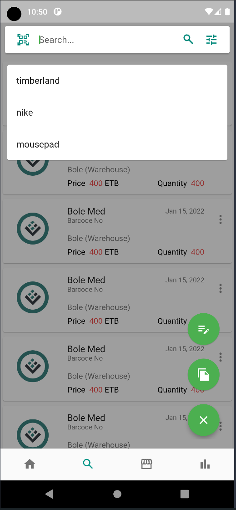
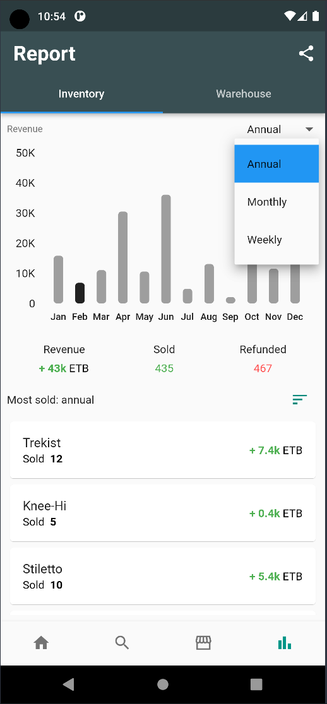
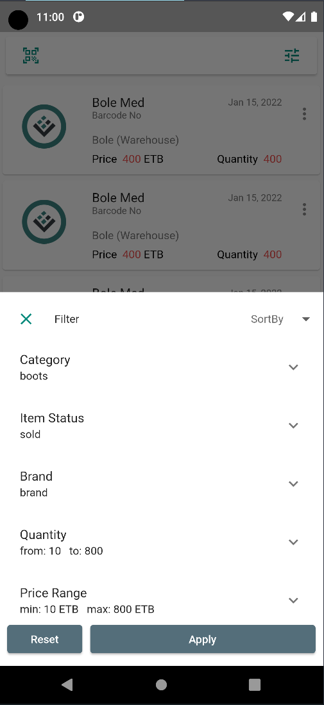

# Inventory Management App

Inventory Management App is a powerful Flutter application designed to help businesses manage their
inventory efficiently. The app comes with a range of features that make it easy for managers and
employees to manage inventory, sales, and more.

## Features

Here are some of the key features of Inventory Management App:

- **User Management:** The app comes with separate user management for managers and employees,
  providing a secure environment for managing and monitoring inventory.
- **Adding Inventory with Variation:** Users can add inventory with variation such as size, color,
  brand, and more, making it easy to manage different types of products.
- **Search Inventory:** The app supports searching inventory with brand, name, or unique barcode,
  enabling users to quickly find the inventory they need.
- **Sales Record and Reports:** The app allows users to view sales records and generate weekly,
  monthly, and annual graphical reports, providing valuable insights into sales performance.
- **Import and Export:** Users can import and export records to and from an Excel sheet, making it
  easy to share inventory data with other team members or applications.
- **Sell and Refund:** The app makes it easy to sell or refund inventory, streamlining the sales
  process and making it more efficient.
- **Custom Categories:** Users can add custom categories to inventories, enabling them to organize
  and manage inventory more effectively.
- **Warehouse Support:** The app comes with support for warehouses, making it easy to manage
  inventory across different locations.
- **Batch Inventory Transfer:** The app supports batch inventory transfer between warehouses, making
  it easy to move inventory between locations.

  
&nbsp; &nbsp; &nbsp; &nbsp;
  
&nbsp; &nbsp; &nbsp; &nbsp;
  
  
&nbsp; &nbsp; &nbsp; &nbsp;
 
&nbsp; &nbsp; &nbsp; &nbsp;
  

## Getting Started

To get started with Inventory Management App, follow these steps:

1. Clone the repository to your local machine
2. Install the required dependencies by running `flutter pub get`
3. Run the app using `flutter run` or your preferred IDE

## Contributing

We welcome contributions to Inventory Management App. To contribute, please follow these steps:

1. Fork the repository
2. Create a new branch for your changes
3. Make your changes and commit them
4. Submit a pull request

## License

Inventory Management App is licensed under the MIT license. See the LICENSE file for more details.
